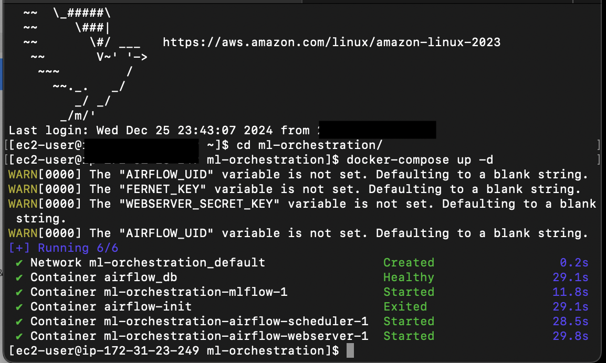
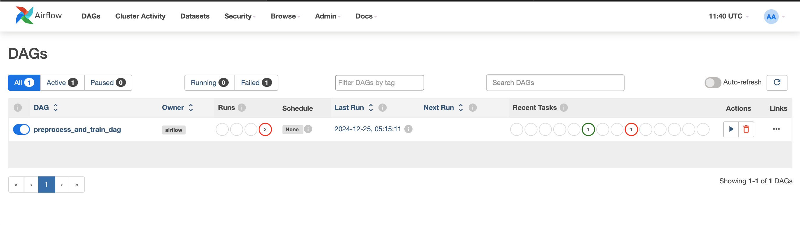
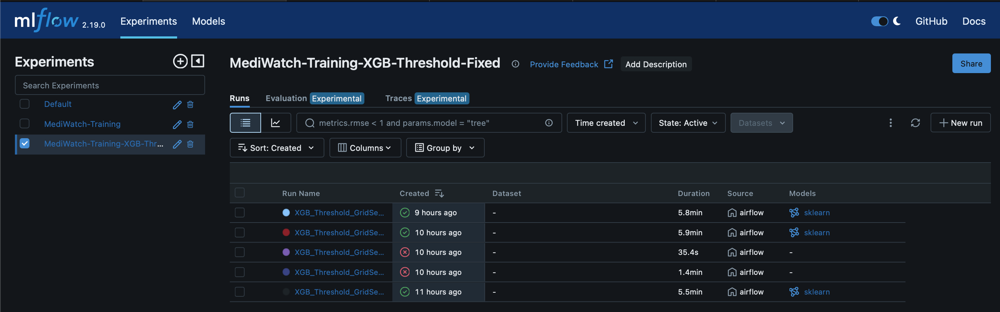

# MediWatch Capstone Project

MediWatch is an end-to-end MLOps capstone project aiming to predict patient readmissions within 30 days (<30 days) using a diabetes-related hospital dataset. The project showcases advanced ML pipelines, custom metrics for imbalanced data, threshold tuning, and robust orchestration using Airflow, MLflow, and optional Docker.

Datasets

```markdown 
    * `diabetic_data.csv` A diabetes-related dataset spanning multiple hospital admissions.

    * `IDS_Mapping.csv` a legend for some of the numerical categories (like admission type and discharge disposition). This dataset was further split into `admission_source_mapping.csv`, `admission_type_mapping.csv`, and `discharge_disposition_mapping.csv`.

    * Key Challenge: <30 readmissions are the minority class, meaning highly imbalanced data (majority are Not <30).

    * The data includes demographic info, lab results, diagnoses, and other features.
```     


The diabetic dataset and IDS_Mapping can be downloaded from [UCI Machine Learning Repository](https://archive.ics.uci.edu/dataset/296/diabetes+130-us+hospitals+for+years+1999-2008).

Additional information for the dataset can be found on [Kaggle](https://www.kaggle.com/datasets/brandao/diabetes/data)

Preprocessing Steps

    1.	Mapping categorical columns (race, gender, etc.) using OneHotEncoder.

    2.	Handling missing values, merging “?” with unknown categories, removing columns with high missingness, etc.

    3.	Converting readmitted to a binary label: <30 vs. Not <30.


## 1. System Architecture

Below is a high-level overview of how the project components fit together:

```
                +-------------------+
                |    Local Files    | (diabetic_data.csv, etc.)
                +-------------------+
                         |
                         v
+------------------+     +-----------------------------------+
|   Airflow DAG    | --> |   Preprocessing (preprocess_data) |
| (Orchestration)  |     +-----------------------------------+
| 1. preprocess    |               |  cleaned_data.csv
| 2. train_model   |               v
| 3. train_xgb     | ------>   [Model Training Scripts]  ----> MLflow (params, metrics, models)
+------------------+               ^

        MLflow UI <---- (logged runs, experiments, model artifacts)
```

	1.	Data:
    	* A dataset in CSV format (e.g., diabetic_data.csv) plus optional mapping files.
	    * Preprocessing merges missing values, normalizes columns, merges ICD mappings, etc.
	2.	Preprocessing:
	    * The script preprocess_data.py cleans data and writes a new CSV (e.g., diabetic_data_cleaned.csv) either locally or to an S3 bucket.
	3.	Airflow:
	    * A DAG (preprocess_and_train_dag.py) with tasks:
            1.	preprocess_data_task → runs preprocess_data.py
            2.	train_model_task → runs train_model.py (e.g., RandomForest baseline)
            3.	train_model_xgb_threshold_task → advanced XGBoost + threshold, cost-based metrics, etc.
	4.	MLflow:
        * Logs each training run: hyperparameters, metrics (precision–recall, custom cost), confusion matrices, and final models.
        * A separate MLflow UI (e.g., at http://localhost:5000) lets you visualize experiments.
	5.	Docker (optional):
        * You can run Airflow, MLflow, and a Postgres container for metadata management (and optional S3 for artifact storage).
        * Alternatively, run everything in a local environment.

## 2. Setup and Installation

### 2.1 Clone or Download the Repository

```bash
git clone https://github.com/youruser/mediwatch-capstone.git
cd mediwatch-capstone
```

Make sure you have the following structure:

```
mediwatch-capstone/
├── data/
│   ├── diabetic_data.csv
│   ├── admission_type_mapping.csv
│   ├── discharge_disposition_mapping.csv
│   └── ...
├── scripts/
│   ├── preprocess_data.py
│   ├── train_model.py
│   ├── train_model_xgb_threshold.py
│   └── ...
├── dags/
│   └── preprocess_and_train_dag.py
├── docker-compose.yml
└── README.md
```

### 2.2 Environment Options

Option A: Docker Compose

	1.	Install Docker & Docker Compose:

        * Docker installation guide

        * Docker Compose installation

	2.	Build & Launch:

```bash
docker-compose build
docker-compose up -d
```


	3.	Check:
        * Airflow at http://localhost:8080 (login with admin/admin if created)
        * MLflow at http://localhost:5000





Option B: Local Python

	1.	Install Python 3.8+

	2.	Install dependencies:

```bash
pip install -r requirements.txt
```

	3.	Initialize Airflow (if desired):

```bash
airflow db init
airflow users create --username admin --password admin --role Admin --email admin@example.com
airflow webserver -p 8080
airflow scheduler
```

	4.	MLflow:

```bash
mlflow server --backend-store-uri sqlite:///mlflow.db --default-artifact-root mlruns --host 0.0.0.0 --port 5000
```
## 3. Pipeline Overview

### 3.1 preprocess_data.py

	* Reads ./data/diabetic_data.csv plus any mapping CSVs.
	* Cleans and merges columns, handles missingness, normalizes certain features.
	* Writes diabetic_data_cleaned.csv locally or to S3.

### 3.2 train_model.py

	* A baseline or random forest approach:
	* Splits data into train/val/test.
	* Possibly does GridSearchCV (hyperparameter tuning).
	* Logs metrics (e.g., F1, precision, recall) to MLflow.

### 3.3 train_model_xgb_threshold.py

	* Uses numeric label encoding for <30 vs. Not <30 to satisfy XGBoost’s constraints.
	* Builds a pipeline with SMOTE, threshold tuning, and custom scorers (precision–recall AUC, cost-based metric).
	* Logs best parameter sets and final performance to MLflow.

### 3.4 preprocess_and_train_dag.py (Airflow DAG)

    1.  preprocess_data_task calls preprocess_data.py.
    2.	train_model_task calls train_model.py.
    3.	train_model_xgb_threshold_task calls train_model_xgb_threshold.py.

    Flow:

    flowchart LR
        A[preprocess_data_task] --> B[train_model_task]
        A --> C[train_model_xgb_threshold_task]

## 4. Running the Entire Pipeline

    After you have Airflow and MLflow running:
        1.	Open Airflow UI at http://localhost:8080.
        2.	Locate the DAG named preprocess_and_train_dag.
        3.	Trigger it manually (via the UI “Trigger DAG” button) or:

    ```bash
    airflow dags trigger preprocess_and_train_dag
    ```

        4.	Watch the tasks:
            * preprocess_data_task runs first, outputs cleaned data.
            * train_model_task and train_model_xgb_threshold_task run (often in parallel or as you configured).

    Checking MLflow Results
        * Visit http://localhost:5000.
        * You should see new experiments (e.g., “MediWatch-Training-XGB-Threshold-Fixed”), each run with param combos, metrics, and artifacts.

## 5. Running Individual Tasks

Airflow CLI:

```bash
docker exec -it <scheduler_container> \
  airflow tasks test preprocess_and_train_dag train_model_xgb_threshold_task 2024-12-25
```

This attempts a test run of just the train_model_xgb_threshold_task.
You can similarly test preprocess_data_task or train_model_task.

## 6. Frequently Encountered Issues

	1.	Label Mismatch
	    * If you see “Invalid classes… [0 1], got [’<30’,‘Not <30’],” ensure your final predictions and y_true are both numeric or both strings.
	    * Our final approach uses numeric predictions [0,1] in scikit-learn scoring, so cost or confusion matrix works.
	2.	FutureWarning: sparse renamed to sparse_output
	    * In the OneHotEncoder, set sparse=False, sparse_output=False to silence it.
	3.	Long Training Times
	    * If you have large param grids, consider adding execution_timeout=timedelta(hours=2) in your Airflow tasks or reduce param grid size.
	4.	MLflow Param Overwrites
	    * In GridSearchCV, each param set must be in a child run if the same param key changes. Use nested=True when logging.
	5.	S3 Credentials
	    * If writing data or artifacts to S3, ensure AWS_ACCESS_KEY_ID / AWS_SECRET_ACCESS_KEY or an attached IAM role is set in the container environment.

## 7. Next Steps

	* Expand Hyperparameter Search: More threshold values, deeper XGBoost trees, different learning rates.
	* Feature Engineering: Summaries of patient history, grouping diagnoses, or domain-specific transformations.
	* Deployment: The final best model can be registered in MLflow’s model registry or served via a REST API (e.g., Flask or FastAPI).
	* Monitoring: In a real environment, track data drift, recalibrate or retrain as necessary.

## 8. Conclusion

MediWatch is a complete, minimially viable demonstration of end-to-end MLOps:
	1.	Data Preprocessing with a Python script, integrated into Airflow.
	2.	Multiple Model Training tasks (RandomForest baseline, XGBoost with custom threshold).
	3.	Experiment Tracking via MLflow.
	4.	Orchestration with Airflow in a Docker-based environment or locally.

By following the steps above, you can re-run any or all tasks in the pipeline, compare metrics in MLflow, and further refine the approach to catch more <30 readmissions effectively—improving patient outcomes and reducing hospital costs.